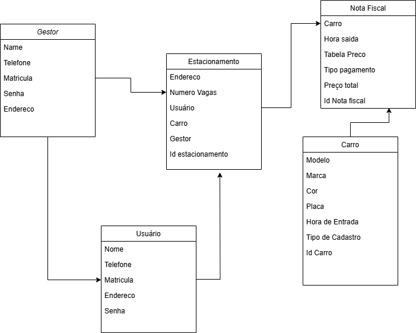

# **SysParking**

Gerencie estacionamentos de forma prática e eficiente com o **SysParking**, uma solução desenvolvida com Angular para simplificar o controle de vagas, usuários e tabelas de preços.

---

## **Deploy Online**
Acesse a versão publicada do sistema clicando no link abaixo:  
[**SysParking Angular → 🚗🚙🚗**](https://sys-parking-angular.firebaseapp.com/login)

---

## **Como acessar o ambiente de desenvolvimento**

### **Baixe/clone o repositório do projeto**
[Link para acessar → Sys-Parking-Angular](https://github.com/SAULvaRGAS88/SysParkingAngular.git) 🚀

### **Pré-requisitos**
1. **Node.js**: Certifique-se de que a versão mais recente do Node.js está instalada em sua máquina.  
2. **Angular CLI**: Instale o Angular CLI globalmente:  
   ```bash
   npm install -g @angular/cli
3. ** Atualize as dependências:
    ```bash
   npm install
4. ** Inicie o projeto:
    ```bash
   ng serve

## Introdução
Um empresário adquiriu recentemente uma rede de estacionamentos que operava com um sistema manual, no qual as entradas e saídas de veículos eram registradas em papel, sem controle integrado com os pagamentos. Essa gestão manual resultava em ineficiências e dificuldades no monitoramento financeiro e operacional dos estacionamentos.

## Descrição do Problema
A ausência de uma solução automatizada e integrada, devido ao sistema arcaico da administração anterior, gerou desafios para a nova administração. Entre eles:
- Falta de visibilidade sobre a disponibilidade de vagas
- Ineficiência na gestão de pagamentos
- Dificuldade no acompanhamento das movimentações diárias e no controle financeiro

## Objetivo
Desenvolver o **SysParking**, um sistema integrado que permite:
1. Controle de acesso de veículos aos estacionamentos.
2. Monitoramento em tempo real dos fluxos de caixa.
3. Maior eficiência e transparência nas operações.
4. Melhoria na experiência dos funcionários e administradores na gestão de estacionamentos.

## Solução Proposta
O **SysParking** será desenvolvido em Angular, com as seguintes funcionalidades:

### 1. Dois Tipos de Acesso
- **Usuário (funcionário):**
  - Controle de entrada e saída de veículos
  - Visualização da disponibilidade de vagas
  - Registro e gestão de pagamentos

- **Administrador (supervisor/dono):**
  - Acesso completo para configuração e gestão do sistema
  - Visualização de relatórios em tempo real sobre o fluxo financeiro e operacional

### 2. Disponibilidade de Vagas
O sistema exibirá a disponibilidade de vagas em tempo real, facilitando o controle do fluxo de veículos e otimizando a ocupação dos estacionamentos.

### 3. Entrada e Saída de Veículos
Cada veículo será registrado com os seguintes dados:
- Modelo, marca e placa
- Horário de entrada e saída

Os funcionários serão responsáveis por registrar e atualizar esses dados no sistema.

### 4. Tabela de Preços
Configuração de tarifas por período:
- Tarifação baseada em horas, dias, ou períodos personalizados.

### 5. Pagamentos
- **Cálculo automático** do custo baseado no tempo de permanência e na tabela de preços vigente.
- Suporte a diversas formas de pagamento:
  - Cartão de crédito, dinheiro e métodos digitais
- Todos os pagamentos serão registrados pelos funcionários e monitorados em tempo real.

### 6. Relatórios
- **Relatórios financeiros** detalhados para o administrador, com informações sobre:
  - Fluxo de caixa diário, semanal e mensal
  - Entrada e saída de veículos

## Conclusão
O **SysParking** permitirá uma gestão eficiente e organizada dos estacionamentos, ao mesmo tempo que oferece maior controle e transparência nas operações financeiras para a administração. Essa solução facilitará a modernização dos processos e proporcionará uma experiência de uso prática e funcional para os funcionários e administradores.

---

**Tecnologia**: Desenvolvido em Angular

**Objetivo Final**: Otimização da gestão de estacionamentos e melhoria no acompanhamento financeiro e operacional.

## Diagrama de Classes


## 👨‍💻 Desenvolvedor
**Saul Vargas**

- 🔗 [LinkedIn](https://www.linkedin.com/in/saul-vargas-68a9734)
- 📞 [WhatsApp](https://wa.me/5551985027412?text=Olá%20Saul!)
